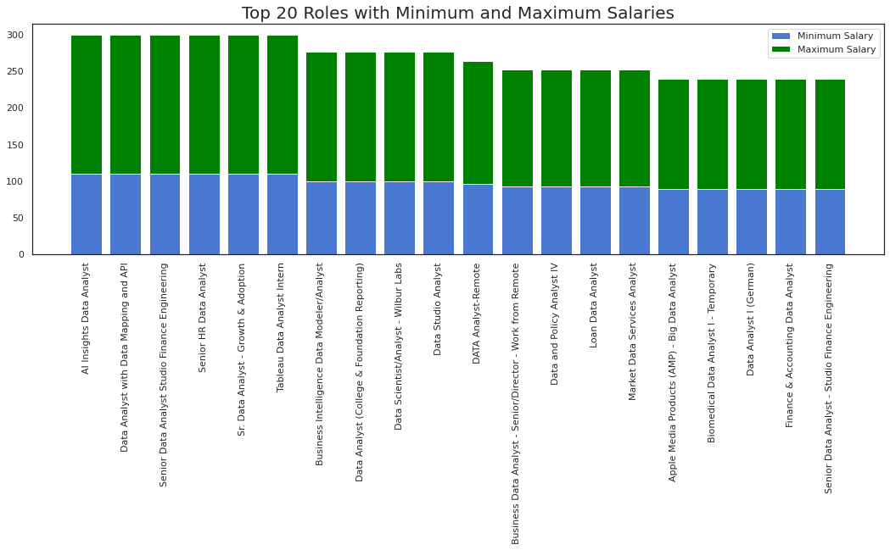
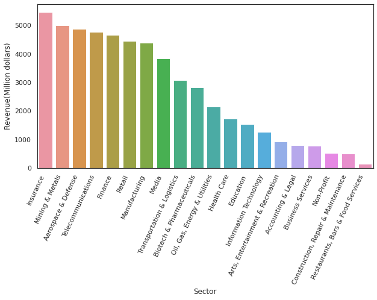
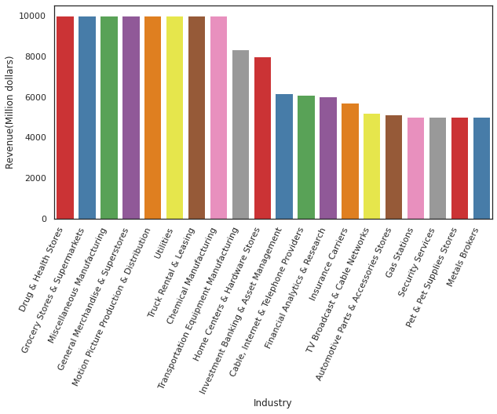
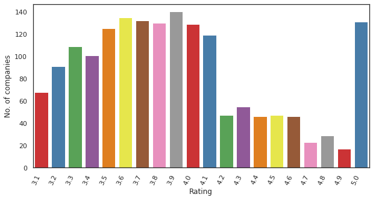
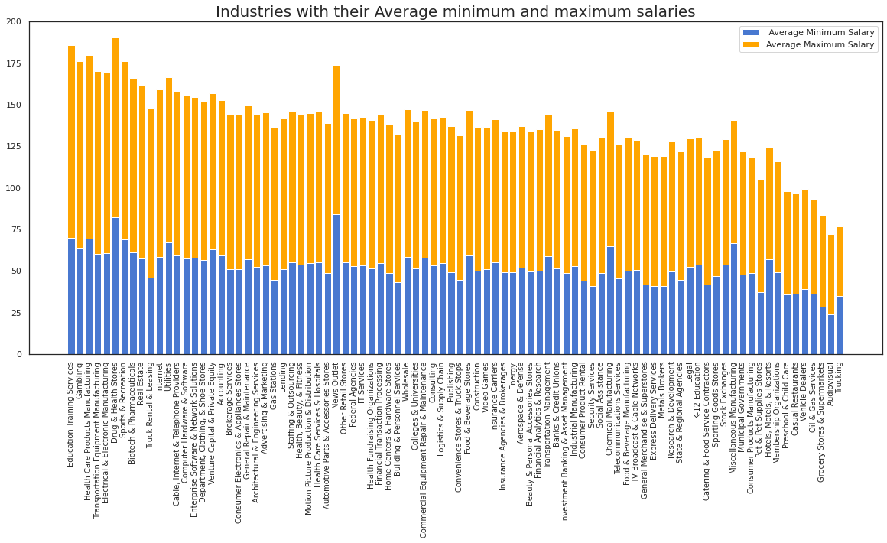
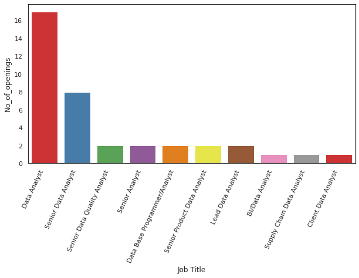
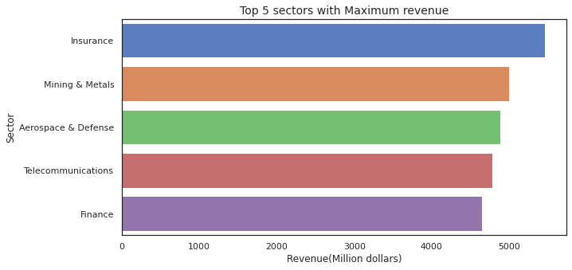

# DATA SCIENCE JOB EDA AND VISUALIZATION

This dataset contains more than 2000 job listing for data science positions, with features such as:

* Salary Estimate
* Location
* Company Rating
* Job Description
  and more.
we are going to analyze no. of job openings, revenues, Avg min and maximum salary etc 


```python
project_name = "DATA SCIENCE JOB EDA AND VISULIZATION" 
```


```python
#import necessary libraries
import numpy as np
import pandas as pd
import matplotlib.pyplot as plt
import seaborn as sns
import warnings #to remove future warning
```

## Data Preparation and Cleaning


```python
#Load dataset
data=pd.read_csv("Datascience.csv")
```


```python
data.head(2)
```


<div>
<style scoped>
    .dataframe tbody tr th:only-of-type {
        vertical-align: middle;
    }

    .dataframe tbody tr th {
        vertical-align: top;
    }

    .dataframe thead th {
        text-align: right;
    }
</style>
<table border="1" class="dataframe">
  <thead>
    <tr style="text-align: right;">
      <th></th>
      <th>Unnamed: 0</th>
      <th>Job Title</th>
      <th>Salary Estimate</th>
      <th>Job Description</th>
      <th>Rating</th>
      <th>Company Name</th>
      <th>Location</th>
      <th>Headquarters</th>
      <th>Size</th>
      <th>Founded</th>
      <th>Type of ownership</th>
      <th>Industry</th>
      <th>Sector</th>
      <th>Revenue</th>
      <th>Competitors</th>
      <th>Easy Apply</th>
    </tr>
  </thead>
  <tbody>
    <tr>
      <th>0</th>
      <td>0</td>
      <td>Data science, Center on Immigration and Justic...</td>
      <td>$37K-$66K (Glassdoor est.)</td>
      <td>Are you eager to roll up your sleeves and harn...</td>
      <td>3.2</td>
      <td>Vera Institute of Justice\n3.2</td>
      <td>New York, NY</td>
      <td>New York, NY</td>
      <td>201 to 500 employees</td>
      <td>1961</td>
      <td>Nonprofit Organization</td>
      <td>Social Assistance</td>
      <td>Non-Profit</td>
      <td>$100 to $500 million (USD)</td>
      <td>-1</td>
      <td>True</td>
    </tr>
    <tr>
      <th>1</th>
      <td>1</td>
      <td>Quality Data science</td>
      <td>$37K-$66K (Glassdoor est.)</td>
      <td>Overview\n\nProvides analytical and technical ...</td>
      <td>3.8</td>
      <td>Visiting Nurse Service of New York\n3.8</td>
      <td>New York, NY</td>
      <td>New York, NY</td>
      <td>10000+ employees</td>
      <td>1893</td>
      <td>Nonprofit Organization</td>
      <td>Health Care Services &amp; Hospitals</td>
      <td>Health Care</td>
      <td>$2 to $5 billion (USD)</td>
      <td>-1</td>
      <td>-1</td>
    </tr>
  </tbody>
</table>
</div>


```python
data.columns
```


    Index(['Unnamed: 0', 'Job Title', 'Salary Estimate', 'Job Description',
           'Rating', 'Company Name', 'Location', 'Headquarters', 'Size', 'Founded',
           'Type of ownership', 'Industry', 'Sector', 'Revenue', 'Competitors',
           'Easy Apply'],
          dtype='object')


**Data includes job title , salary estimation , job description , rating ,company name , location and many more ...**

# DATA CLEANING

### Remove the unnamed column


```python
data.drop(['Unnamed: 0'], axis=1,inplace=True)
```

### Check for missing values


```python
# We will be using function missing_values_table to check missing values

def missing_values_table(df):
        # Total missing values
        mis_val = df.isnull().sum()
        
        # Percentage of missing values
        mis_val_percent = 100 * df.isnull().sum() / len(df)
        
        # Make a table with the results
        mis_val_table = pd.concat([mis_val, mis_val_percent], axis=1)
        
        # Rename the columns
        mis_val_table_ren_columns = mis_val_table.rename(
        columns = {0 : 'Missing Values', 1 : '% of Total Values'})
        
        # Sort the table by percentage of missing descending
        mis_val_table_ren_columns = mis_val_table_ren_columns[
            mis_val_table_ren_columns.iloc[:,1] != 0].sort_values(
        '% of Total Values', ascending=False).round(1)
        
        # Print some summary information
        print ("Your selected dataframe has " + str(df.shape[1]) + " columns.\n"      
            "There are " + str(mis_val_table_ren_columns.shape[0]) +
              " columns that have missing values.")
        
        # Return the dataframe with missing information
        return mis_val_table_ren_columns

```

As some of the columns contains -1 or '-1.0' or '-1' etc . We need to clean this(This is kind of null values)

Replace -1 or -1.0 or '-1' to NaN


```python
missing_values_table(data)
```

    Your selected dataframe has 15 columns.
    There are 1 columns that have missing values.
    


<div>
<style scoped>
    .dataframe tbody tr th:only-of-type {
        vertical-align: middle;
    }

    .dataframe tbody tr th {
        vertical-align: top;
    }

    .dataframe thead th {
        text-align: right;
    }
</style>
<table border="1" class="dataframe">
  <thead>
    <tr style="text-align: right;">
      <th></th>
      <th>Missing Values</th>
      <th>% of Total Values</th>
    </tr>
  </thead>
  <tbody>
    <tr>
      <th>Company Name</th>
      <td>1</td>
      <td>0.0</td>
    </tr>
  </tbody>
</table>
</div>


Now you can see there are lots of missing values in the dataset. 'Easy Apply' and 'Competitors' has maximum number of missing values (> 50%)

Most companies has null values in easy apply because they are not hiring .


```python
data['Easy Apply'].value_counts()
```


    -1      2173
    True      80
    Name: Easy Apply, dtype: int64


```python
data['Competitors'].value_counts()
```


    -1                                                1732
    Robert Half, Insight Global                         14
    Adecco, Manpower                                    14
    Google, Microsoft, Samsung Electronics              10
    TEKsystems, Insight Global, Accenture               10
                                                      ... 
    Aerotek, Kforce, Glotel                              1
    Audi, BMW, Mercedes-Benz International               1
    Cognizant Technology Solutions, Accenture, IBM       1
    Aon, Accenture, Marsh & McLennan Companies           1
    First Service Networks, SMS Assist, Vixxo            1
    Name: Competitors, Length: 291, dtype: int64


```python
data['Competitors'].value_counts()
```


    -1                                                1732
    Robert Half, Insight Global                         14
    Adecco, Manpower                                    14
    Google, Microsoft, Samsung Electronics              10
    TEKsystems, Insight Global, Accenture               10
                                                      ... 
    Aerotek, Kforce, Glotel                              1
    Audi, BMW, Mercedes-Benz International               1
    Cognizant Technology Solutions, Accenture, IBM       1
    Aon, Accenture, Marsh & McLennan Companies           1
    First Service Networks, SMS Assist, Vixxo            1
    Name: Competitors, Length: 291, dtype: int64


```python
data['Rating'].value_counts()[:5]
```


    -1.0    272
     3.9    140
     3.6    135
     3.7    132
     5.0    131
    Name: Rating, dtype: int64


```python
data=data.replace(-1,np.nan)
data=data.replace(-1.0,np.nan)
data=data.replace('-1',np.nan)
```


```python
missing_values_table(data)
```

    Your selected dataframe has 15 columns.
    There are 12 columns that have missing values.
    


<div>
<style scoped>
    .dataframe tbody tr th:only-of-type {
        vertical-align: middle;
    }

    .dataframe tbody tr th {
        vertical-align: top;
    }

    .dataframe thead th {
        text-align: right;
    }
</style>
<table border="1" class="dataframe">
  <thead>
    <tr style="text-align: right;">
      <th></th>
      <th>Missing Values</th>
      <th>% of Total Values</th>
    </tr>
  </thead>
  <tbody>
    <tr>
      <th>Easy Apply</th>
      <td>2173</td>
      <td>96.4</td>
    </tr>
    <tr>
      <th>Competitors</th>
      <td>1732</td>
      <td>76.9</td>
    </tr>
    <tr>
      <th>Founded</th>
      <td>660</td>
      <td>29.3</td>
    </tr>
    <tr>
      <th>Industry</th>
      <td>353</td>
      <td>15.7</td>
    </tr>
    <tr>
      <th>Sector</th>
      <td>353</td>
      <td>15.7</td>
    </tr>
    <tr>
      <th>Rating</th>
      <td>272</td>
      <td>12.1</td>
    </tr>
    <tr>
      <th>Headquarters</th>
      <td>172</td>
      <td>7.6</td>
    </tr>
    <tr>
      <th>Size</th>
      <td>163</td>
      <td>7.2</td>
    </tr>
    <tr>
      <th>Type of ownership</th>
      <td>163</td>
      <td>7.2</td>
    </tr>
    <tr>
      <th>Revenue</th>
      <td>163</td>
      <td>7.2</td>
    </tr>
    <tr>
      <th>Salary Estimate</th>
      <td>1</td>
      <td>0.0</td>
    </tr>
    <tr>
      <th>Company Name</th>
      <td>1</td>
      <td>0.0</td>
    </tr>
  </tbody>
</table>
</div>


```python
warnings.filterwarnings("ignore", category=FutureWarning)#to remove warning caused by iteration over strings
```


```python
data['Company Name'],_=data['Company Name'].str.split('\n', 1).str
```


```python
data['Job Title'],data['Department']=data['Job Title'].str.split(',', 1).str
```


```python
data['Salary Estimate'],_=data['Salary Estimate'].str.split('(', 1).str
```


```python
data['Min_Salary'],data['Max_Salary']=data['Salary Estimate'].str.split('-').str
data['Min_Salary']=data['Min_Salary'].str.strip(' ').str.lstrip('$').str.rstrip('K').fillna(0).astype('int')
data['Max_Salary']=data['Max_Salary'].str.strip(' ').str.lstrip('$').str.rstrip('K').fillna(0).astype('int')
```

## Exploratory Analysis and Visualization


```python
# Split salary into two columns min salary and max salary.
data.drop(['Salary Estimate'],axis=1,inplace=True)
```

# Current openings 


```python
data['Easy Apply']=data['Easy Apply'].fillna(False).astype('bool')
```


```python
df_easy_apply=data[data['Easy Apply']==True]
df=df_easy_apply.groupby('Company Name')['Easy Apply'].count().reset_index()
company_opening_df=df.sort_values('Easy Apply',ascending=False).head(10)

```


```python
company_opening_df
```


<div>
<style scoped>
    .dataframe tbody tr th:only-of-type {
        vertical-align: middle;
    }

    .dataframe tbody tr th {
        vertical-align: top;
    }

    .dataframe thead th {
        text-align: right;
    }
</style>
<table border="1" class="dataframe">
  <thead>
    <tr style="text-align: right;">
      <th></th>
      <th>Company Name</th>
      <th>Easy Apply</th>
    </tr>
  </thead>
  <tbody>
    <tr>
      <th>3</th>
      <td>Apex Systems</td>
      <td>10</td>
    </tr>
    <tr>
      <th>1</th>
      <td>22nd Century Technologies</td>
      <td>5</td>
    </tr>
    <tr>
      <th>8</th>
      <td>Chime</td>
      <td>3</td>
    </tr>
    <tr>
      <th>46</th>
      <td>Signify Health</td>
      <td>3</td>
    </tr>
    <tr>
      <th>0</th>
      <td>22nd Century Staffing</td>
      <td>2</td>
    </tr>
    <tr>
      <th>50</th>
      <td>Tempus Labs</td>
      <td>2</td>
    </tr>
    <tr>
      <th>53</th>
      <td>Undertone</td>
      <td>2</td>
    </tr>
    <tr>
      <th>5</th>
      <td>BOLD</td>
      <td>2</td>
    </tr>
    <tr>
      <th>36</th>
      <td>Omada Health</td>
      <td>1</td>
    </tr>
    <tr>
      <th>35</th>
      <td>OSI Engineering</td>
      <td>1</td>
    </tr>
  </tbody>
</table>
</div>


```python
#visualizing current opening with bar plot
plt.figure(figsize=(10,5))
chart = sns.barplot(
    data=company_opening_df,
    x='Company Name',
    y='Easy Apply',
    palette='Set1'
)
chart=chart.set_xticklabels(
    chart.get_xticklabels(), 
    rotation=65, 
    horizontalalignment='right',
    fontweight='light',
 )
```


**These are the top 10 companies hiring for Data science roles**

# Salary Distribution of Data science


```python
data_science = data[data['Job Title']=='Data science']


sns.set(style="white", palette="muted", color_codes=True)


f, axes = plt.subplots(1, 2, figsize=(15, 8), sharex=True)
sns.despine(left=True)

#Plot a histogram and kernel density estimate

sns.distplot(data_science['Min_Salary'], color="b", ax=axes[0])

sns.distplot(data_science['Max_Salary'], color="r",ax=axes[1])

plt.setp(axes, yticks=[])
plt.tight_layout()
```


# Top 20 Roles with their minimum and maximum salaries


```python
df=data.groupby('Location')[['Max_Salary','Min_Salary']].mean().sort_values(['Max_Salary','Min_Salary'],ascending=False).head(20)
```


```python
df=data.groupby('Job Title')[['Max_Salary','Min_Salary']].mean().sort_values(['Max_Salary','Min_Salary'],ascending=False).head(20)
```


```python
df
```


<div>
<style scoped>
    .dataframe tbody tr th:only-of-type {
        vertical-align: middle;
    }

    .dataframe tbody tr th {
        vertical-align: top;
    }

    .dataframe thead th {
        text-align: right;
    }
</style>
<table border="1" class="dataframe">
  <thead>
    <tr style="text-align: right;">
      <th></th>
      <th>Max_Salary</th>
      <th>Min_Salary</th>
    </tr>
    <tr>
      <th>Job Title</th>
      <th></th>
      <th></th>
    </tr>
  </thead>
  <tbody>
    <tr>
      <th>AI Insights Data science</th>
      <td>190.0</td>
      <td>110.0</td>
    </tr>
    <tr>
      <th>Data science with Data Mapping and API</th>
      <td>190.0</td>
      <td>110.0</td>
    </tr>
    <tr>
      <th>Senior Data science Studio Finance Engineering</th>
      <td>190.0</td>
      <td>110.0</td>
    </tr>
    <tr>
      <th>Senior HR Data science</th>
      <td>190.0</td>
      <td>110.0</td>
    </tr>
    <tr>
      <th>Sr. Data science - Growth &amp; Adoption</th>
      <td>190.0</td>
      <td>110.0</td>
    </tr>
    <tr>
      <th>Tableau Data science Intern</th>
      <td>190.0</td>
      <td>110.0</td>
    </tr>
    <tr>
      <th>Business Intelligence Data Modeler/science</th>
      <td>178.0</td>
      <td>99.0</td>
    </tr>
    <tr>
      <th>Data science (College &amp; Foundation Reporting)</th>
      <td>178.0</td>
      <td>99.0</td>
    </tr>
    <tr>
      <th>Data Scientist/science - Wilbur Labs</th>
      <td>178.0</td>
      <td>99.0</td>
    </tr>
    <tr>
      <th>Data Studio science</th>
      <td>178.0</td>
      <td>99.0</td>
    </tr>
    <tr>
      <th>DATA science-Remote</th>
      <td>168.5</td>
      <td>96.0</td>
    </tr>
    <tr>
      <th>Business Data science - Senior/Director - Work from Remote</th>
      <td>159.0</td>
      <td>93.0</td>
    </tr>
    <tr>
      <th>Data and Policy science IV</th>
      <td>159.0</td>
      <td>93.0</td>
    </tr>
    <tr>
      <th>Loan Data science</th>
      <td>159.0</td>
      <td>93.0</td>
    </tr>
    <tr>
      <th>Market Data Services science</th>
      <td>159.0</td>
      <td>93.0</td>
    </tr>
    <tr>
      <th>Apple Media Products (AMP) - Big Data science</th>
      <td>151.0</td>
      <td>89.0</td>
    </tr>
    <tr>
      <th>Biomedical Data science I - Temporary</th>
      <td>151.0</td>
      <td>89.0</td>
    </tr>
    <tr>
      <th>Data science I (German)</th>
      <td>151.0</td>
      <td>89.0</td>
    </tr>
    <tr>
      <th>Finance &amp; Accounting Data science</th>
      <td>151.0</td>
      <td>89.0</td>
    </tr>
    <tr>
      <th>Senior Data science - Studio Finance Engineering</th>
      <td>151.0</td>
      <td>89.0</td>
    </tr>
  </tbody>
</table>
</div>


```python
#visualizing Top 20 Roles with Minimum and Maximum Salaries with stacked bar graph
f, ax = plt.subplots(figsize=(18,5))
plt.title('Top 20 Roles with Minimum and Maximum Salaries',fontsize=20)
plt.bar(df.index,df.Min_Salary)
plt.bar(df.index,df.Max_Salary,bottom=df.Min_Salary, color="green")
plt.legend(['Minimum Salary','Maximum Salary'])
plt.xticks(rotation=90);

```





# Size of Employees Vs No of Companies


```python
df=data['Size'].value_counts()
```


```python
df=pd.DataFrame(df)
df['employee_size']=df.index
```


```python
df.reset_index(inplace=True)
df.drop(['index'],axis=1,inplace=True)
```


```python
df=df.rename(columns={"Size": "No_of_companies"})
```


```python
df
```


<div>
<style scoped>
    .dataframe tbody tr th:only-of-type {
        vertical-align: middle;
    }

    .dataframe tbody tr th {
        vertical-align: top;
    }

    .dataframe thead th {
        text-align: right;
    }
</style>
<table border="1" class="dataframe">
  <thead>
    <tr style="text-align: right;">
      <th></th>
      <th>Job Title</th>
      <th>No_of_openings</th>
    </tr>
  </thead>
  <tbody>
    <tr>
      <th>0</th>
      <td>Data science</td>
      <td>17</td>
    </tr>
    <tr>
      <th>1</th>
      <td>Senior Data science</td>
      <td>8</td>
    </tr>
    <tr>
      <th>2</th>
      <td>Senior Data Quality science</td>
      <td>2</td>
    </tr>
    <tr>
      <th>3</th>
      <td>Senior science</td>
      <td>2</td>
    </tr>
    <tr>
      <th>4</th>
      <td>Data Base Programmer/science</td>
      <td>2</td>
    </tr>
    <tr>
      <th>5</th>
      <td>Senior Product Data science</td>
      <td>2</td>
    </tr>
    <tr>
      <th>6</th>
      <td>Lead Data science</td>
      <td>2</td>
    </tr>
    <tr>
      <th>7</th>
      <td>BI/Data science</td>
      <td>1</td>
    </tr>
    <tr>
      <th>8</th>
      <td>Supply Chain Data science</td>
      <td>1</td>
    </tr>
    <tr>
      <th>9</th>
      <td>Client Data science</td>
      <td>1</td>
    </tr>
  </tbody>
</table>
</div>


```python
plt.figure(figsize=(10,5))
chart = sns.barplot(
    data=df,
    x='employee_size',
    y='No_of_companies',
    palette='Set1'
)
chart=chart.set_xticklabels(
    chart.get_xticklabels(), 
    rotation=65, 
    horizontalalignment='right',
    fontweight='light',
 
)
```


**maximum companies having size 1-200 or 5000**

# Revenue of different sectors


```python
#The Revenue has  different units we need to change it into same unit and also has to take average as the revenue is given as interval
def filter_revenue(x):
    revenue=0
    if(x== 'Unknown / Non-Applicable' or type(x)==float):
        revenue=0
    elif(('million' in x) and ('billion' not in x)):
        maxRev = x.replace('(USD)','').replace("million",'').replace('$','').strip().split('to')
        if('Less than' in maxRev[0]):
            revenue = float(maxRev[0].replace('Less than','').strip())
        else:
            if(len(maxRev)==2):
                revenue = float(maxRev[1])
            elif(len(maxRev)<2):
                revenue = float(maxRev[0])
    elif(('billion'in x)):
        maxRev = x.replace('(USD)','').replace("billion",'').replace('$','').strip().split('to')
        if('+' in maxRev[0]):
            revenue = float(maxRev[0].replace('+','').strip())*1000
        else:
            if(len(maxRev)==2):
                revenue = float(maxRev[1])*1000
            elif(len(maxRev)<2):
                revenue = float(maxRev[0])*1000
    return revenue
        
```


```python
data['Max_revenue']=data['Revenue'].apply(lambda x: filter_revenue(x))
```


```python
df=data.groupby('Sector')[['Max_revenue']].mean().sort_values(['Max_revenue'],ascending=False).head(20)
```


```python
df.reset_index(inplace=True)
```


```python
df
```


<div>
<style scoped>
    .dataframe tbody tr th:only-of-type {
        vertical-align: middle;
    }

    .dataframe tbody tr th {
        vertical-align: top;
    }

    .dataframe thead th {
        text-align: right;
    }
</style>
<table border="1" class="dataframe">
  <thead>
    <tr style="text-align: right;">
      <th></th>
      <th>Max_revenue</th>
    </tr>
    <tr>
      <th>Sector</th>
      <th></th>
    </tr>
  </thead>
  <tbody>
    <tr>
      <th>Insurance</th>
      <td>5465.196078</td>
    </tr>
    <tr>
      <th>Mining &amp; Metals</th>
      <td>5000.000000</td>
    </tr>
    <tr>
      <th>Aerospace &amp; Defense</th>
      <td>4884.090909</td>
    </tr>
    <tr>
      <th>Telecommunications</th>
      <td>4778.181818</td>
    </tr>
    <tr>
      <th>Finance</th>
      <td>4653.881657</td>
    </tr>
    <tr>
      <th>Retail</th>
      <td>4447.394737</td>
    </tr>
    <tr>
      <th>Manufacturing</th>
      <td>4382.625000</td>
    </tr>
    <tr>
      <th>Media</th>
      <td>3837.880952</td>
    </tr>
    <tr>
      <th>Transportation &amp; Logistics</th>
      <td>3080.000000</td>
    </tr>
    <tr>
      <th>Biotech &amp; Pharmaceuticals</th>
      <td>2835.636364</td>
    </tr>
    <tr>
      <th>Oil, Gas, Energy &amp; Utilities</th>
      <td>2146.153846</td>
    </tr>
    <tr>
      <th>Health Care</th>
      <td>1728.324503</td>
    </tr>
    <tr>
      <th>Education</th>
      <td>1541.634615</td>
    </tr>
    <tr>
      <th>Information Technology</th>
      <td>1274.575439</td>
    </tr>
    <tr>
      <th>Arts, Entertainment &amp; Recreation</th>
      <td>928.571429</td>
    </tr>
    <tr>
      <th>Accounting &amp; Legal</th>
      <td>798.418605</td>
    </tr>
    <tr>
      <th>Business Services</th>
      <td>788.543893</td>
    </tr>
    <tr>
      <th>Non-Profit</th>
      <td>524.615385</td>
    </tr>
    <tr>
      <th>Construction, Repair &amp; Maintenance</th>
      <td>503.500000</td>
    </tr>
    <tr>
      <th>Restaurants, Bars &amp; Food Services</th>
      <td>139.625000</td>
    </tr>
  </tbody>
</table>
</div>


```python
#visualizing the revenue of different sectors
plt.figure(figsize=(10,5))
chart = sns.barplot(
    data=df,
    x=df.index,
    y='Max_revenue'
)
chart.set_xticklabels(
    chart.get_xticklabels(), 
    rotation=65, 
    horizontalalignment='right',
    fontweight='light',
 
)
chart.axes.yaxis.label.set_text("Revenue(Million dollars)")

```





As you can see from the graph **highest revenue** is from **Insurance**

# Revenue of different Industries


```python
df=data.groupby('Industry')[['Max_revenue']].mean().sort_values(['Max_revenue'],ascending=False).head(20)
```


```python
df.reset_index(inplace=True)
```


```python
df
```


<div>
<style scoped>
    .dataframe tbody tr th:only-of-type {
        vertical-align: middle;
    }

    .dataframe tbody tr th {
        vertical-align: top;
    }

    .dataframe thead th {
        text-align: right;
    }
</style>
<table border="1" class="dataframe">
  <thead>
    <tr style="text-align: right;">
      <th></th>
      <th>Industry</th>
      <th>Max_revenue</th>
    </tr>
  </thead>
  <tbody>
    <tr>
      <th>0</th>
      <td>Drug &amp; Health Stores</td>
      <td>10000.000000</td>
    </tr>
    <tr>
      <th>1</th>
      <td>Grocery Stores &amp; Supermarkets</td>
      <td>10000.000000</td>
    </tr>
    <tr>
      <th>2</th>
      <td>Miscellaneous Manufacturing</td>
      <td>10000.000000</td>
    </tr>
    <tr>
      <th>3</th>
      <td>General Merchandise &amp; Superstores</td>
      <td>10000.000000</td>
    </tr>
    <tr>
      <th>4</th>
      <td>Motion Picture Production &amp; Distribution</td>
      <td>10000.000000</td>
    </tr>
    <tr>
      <th>5</th>
      <td>Utilities</td>
      <td>10000.000000</td>
    </tr>
    <tr>
      <th>6</th>
      <td>Truck Rental &amp; Leasing</td>
      <td>10000.000000</td>
    </tr>
    <tr>
      <th>7</th>
      <td>Chemical Manufacturing</td>
      <td>10000.000000</td>
    </tr>
    <tr>
      <th>8</th>
      <td>Transportation Equipment Manufacturing</td>
      <td>8333.333333</td>
    </tr>
    <tr>
      <th>9</th>
      <td>Home Centers &amp; Hardware Stores</td>
      <td>8000.000000</td>
    </tr>
    <tr>
      <th>10</th>
      <td>Investment Banking &amp; Asset Management</td>
      <td>6161.358974</td>
    </tr>
    <tr>
      <th>11</th>
      <td>Cable, Internet &amp; Telephone Providers</td>
      <td>6102.000000</td>
    </tr>
    <tr>
      <th>12</th>
      <td>Financial Analytics &amp; Research</td>
      <td>6000.000000</td>
    </tr>
    <tr>
      <th>13</th>
      <td>Insurance Carriers</td>
      <td>5694.148936</td>
    </tr>
    <tr>
      <th>14</th>
      <td>TV Broadcast &amp; Cable Networks</td>
      <td>5201.000000</td>
    </tr>
    <tr>
      <th>15</th>
      <td>Automotive Parts &amp; Accessories Stores</td>
      <td>5125.000000</td>
    </tr>
    <tr>
      <th>16</th>
      <td>Gas Stations</td>
      <td>5000.000000</td>
    </tr>
    <tr>
      <th>17</th>
      <td>Security Services</td>
      <td>5000.000000</td>
    </tr>
    <tr>
      <th>18</th>
      <td>Pet &amp; Pet Supplies Stores</td>
      <td>5000.000000</td>
    </tr>
    <tr>
      <th>19</th>
      <td>Metals Brokers</td>
      <td>5000.000000</td>
    </tr>
  </tbody>
</table>
</div>


```python
#visualizing the revenue of different industries
plt.figure(figsize=(10,5))
chart = sns.barplot(
    data=df,
    x='Industry',
    y='Max_revenue',
    palette='Set1'
)
chart.set_xticklabels(
    chart.get_xticklabels(), 
    rotation=65, 
    horizontalalignment='right',
    fontweight='light',
 
)
chart.axes.yaxis.label.set_text("Revenue(Million dollars)")
```





As you can see from the graph **highest revenue** is from **Drug & Health Stores**

# Ratings 


```python
count=data.groupby('Rating')['Company Name'].count()
```


```python
df=pd.DataFrame(count).rename(columns={'Company Name': 'Count'}).reset_index()
```


```python
df=df.sort_values('Rating',ascending=False).head(20)

```


```python
#visualizing Ratings
plt.figure(figsize=(10,5))
chart = sns.barplot(
    data=df,
    x='Rating',
    y='Count',
    palette='Set1'
)
chart.set_xticklabels(
    chart.get_xticklabels(), 
    rotation=65, 
    horizontalalignment='right',
    fontweight='light',
 
)
chart.axes.yaxis.label.set_text("No. of companies")
```





# Industries with their Average minimum and maximum salaries


```python
df=data.groupby('Industry')[['Min_Salary','Max_Salary']].mean().rename(columns={'Min_Salary':'Avg_min_salary','Max_Salary':'Avg_max_salary'})
```


```python
df=df.reset_index()
```


```python
df=df.sort_values(['Avg_max_salary','Avg_max_salary'],ascending=False)
```


```python
df
```


<div>
<style scoped>
    .dataframe tbody tr th:only-of-type {
        vertical-align: middle;
    }

    .dataframe tbody tr th {
        vertical-align: top;
    }

    .dataframe thead th {
        text-align: right;
    }
</style>
<table border="1" class="dataframe">
  <thead>
    <tr style="text-align: right;">
      <th></th>
      <th>Industry</th>
      <th>Avg_min_salary</th>
      <th>Avg_max_salary</th>
    </tr>
  </thead>
  <tbody>
    <tr>
      <th>0</th>
      <td>Education Training Services</td>
      <td>69.666667</td>
      <td>116.000000</td>
    </tr>
    <tr>
      <th>1</th>
      <td>Gambling</td>
      <td>64.000000</td>
      <td>112.000000</td>
    </tr>
    <tr>
      <th>2</th>
      <td>Health Care Products Manufacturing</td>
      <td>69.200000</td>
      <td>110.400000</td>
    </tr>
    <tr>
      <th>3</th>
      <td>Transportation Equipment Manufacturing</td>
      <td>60.333333</td>
      <td>109.666667</td>
    </tr>
    <tr>
      <th>4</th>
      <td>Electrical &amp; Electronic Manufacturing</td>
      <td>60.833333</td>
      <td>108.500000</td>
    </tr>
    <tr>
      <th>...</th>
      <td>...</td>
      <td>...</td>
      <td>...</td>
    </tr>
    <tr>
      <th>83</th>
      <td>Vehicle Dealers</td>
      <td>39.000000</td>
      <td>60.333333</td>
    </tr>
    <tr>
      <th>84</th>
      <td>Oil &amp; Gas Services</td>
      <td>36.250000</td>
      <td>56.500000</td>
    </tr>
    <tr>
      <th>85</th>
      <td>Grocery Stores &amp; Supermarkets</td>
      <td>28.333333</td>
      <td>54.666667</td>
    </tr>
    <tr>
      <th>86</th>
      <td>Audiovisual</td>
      <td>24.000000</td>
      <td>48.000000</td>
    </tr>
    <tr>
      <th>87</th>
      <td>Trucking</td>
      <td>35.000000</td>
      <td>42.000000</td>
    </tr>
  </tbody>
</table>
<p>88 rows × 3 columns</p>
</div>


```python
#visualizing Industries with their Average minimum and maximum salaries
f, ax = plt.subplots(figsize=(20,8))
plt.title('Industries with their Average minimum and maximum salaries',fontsize=20)
plt.bar(df.Industry,df.Avg_min_salary)
plt.bar(df.Industry,df.Avg_max_salary,bottom=df.Avg_min_salary, color="orange")
plt.legend([' Average Minimum Salary','Average Maximum Salary'])
plt.xticks(rotation=90,fontsize=10);

```





# Jobs with Openings


```python
df=pd.DataFrame(data[data['Easy Apply']==True]['Job Title'].value_counts()).rename(columns={'Job Title':'No_of_openings'})
```


```python
df=df.reset_index().rename(columns={'index':'Job Title'})
```


```python
df=df.head(10)
```


```python
df
```


<div>
<style scoped>
    .dataframe tbody tr th:only-of-type {
        vertical-align: middle;
    }

    .dataframe tbody tr th {
        vertical-align: top;
    }

    .dataframe thead th {
        text-align: right;
    }
</style>
<table border="1" class="dataframe">
  <thead>
    <tr style="text-align: right;">
      <th></th>
      <th>Job Title</th>
      <th>No_of_openings</th>
    </tr>
  </thead>
  <tbody>
    <tr>
      <th>0</th>
      <td>Data science</td>
      <td>17</td>
    </tr>
    <tr>
      <th>1</th>
      <td>Senior Data science</td>
      <td>8</td>
    </tr>
    <tr>
      <th>2</th>
      <td>Senior Data Quality science</td>
      <td>2</td>
    </tr>
    <tr>
      <th>3</th>
      <td>Senior science</td>
      <td>2</td>
    </tr>
    <tr>
      <th>4</th>
      <td>Data Base Programmer/science</td>
      <td>2</td>
    </tr>
    <tr>
      <th>5</th>
      <td>Senior Product Data science</td>
      <td>2</td>
    </tr>
    <tr>
      <th>6</th>
      <td>Lead Data science</td>
      <td>2</td>
    </tr>
    <tr>
      <th>7</th>
      <td>BI/Data science</td>
      <td>1</td>
    </tr>
    <tr>
      <th>8</th>
      <td>Supply Chain Data science</td>
      <td>1</td>
    </tr>
    <tr>
      <th>9</th>
      <td>Client Data science</td>
      <td>1</td>
    </tr>
  </tbody>
</table>
</div>


```python
#visualizing job opening of data science
plt.figure(figsize=(10,5))
chart = sns.barplot(
    data=df,
    x='Job Title',
    y='No_of_openings',
    palette='Set1'
)
chart=chart.set_xticklabels(
    chart.get_xticklabels(), 
    rotation=65, 
    horizontalalignment='right',
    fontweight='light',
 
)

```





```python
import jovian
```


```python
jovian.commit()
```


    <IPython.core.display.Javascript object>


    [jovian] Attempting to save notebook..
    [jovian] Updating notebook "cvam-jnv/data-science-job-eda-and-visulization" on https://jovian.ml/
    [jovian] Uploading notebook..
    [jovian] Capturing environment..
    [jovian] Committed successfully! https://jovian.ml/cvam-jnv/data-science-job-eda-and-visulization
    


    'https://jovian.ml/cvam-jnv/data-science-job-eda-and-visulization'


## Asking and Answering Questions

## What is the maximum salary offered to Data science ?


```python
maximum_salary=data_science['Max_Salary'].max()
print('The maximum salary offered to Data science is ${}k.'.format(maximum_salary))
```

    The maximum salary offered to Data science is $190k.
    

# What is the minimum salary offered to Data science ?


```python
minimum_salary=data_science['Max_Salary'].min()
print('The minimum salary offered to Data science is ${}k.'.format(minimum_salary))
```

    The minimum salary offered to Data science is $38k.
    

# What is the maximum number of job opening for Data science?


```python
df=pd.DataFrame(data[data['Easy Apply']==True]['Job Title'].value_counts()).rename(columns={'Job Title':'No_of_openings'})
df=df.reset_index().rename(columns={'index':'Job Title'})
max_job_opening=df.No_of_openings.max()
print('The maximum job opening for Data science is  {}.'.format(max_job_opening))
```

    The maximum job opening for Data science is  17.
    

# What is the maximum easy apply job openings?


```python
max_easy_apply=company_opening_df['Easy Apply'].max()
print('The maximum easy apply job for Data science is  {}.'.format(max_easy_apply))
```

    The maximum easy apply job for Data science is  10.
    

# Which company has the maximum easy apply job openings ?


```python
company_opening_df.loc[company_opening_df['Easy Apply'] == max_easy_apply]
```


<div>
<style scoped>
    .dataframe tbody tr th:only-of-type {
        vertical-align: middle;
    }

    .dataframe tbody tr th {
        vertical-align: top;
    }

    .dataframe thead th {
        text-align: right;
    }
</style>
<table border="1" class="dataframe">
  <thead>
    <tr style="text-align: right;">
      <th></th>
      <th>Company Name</th>
      <th>Easy Apply</th>
    </tr>
  </thead>
  <tbody>
    <tr>
      <th>3</th>
      <td>Apex Systems</td>
      <td>10</td>
    </tr>
  </tbody>
</table>
</div>


The Apex Systems has maximum easy apply openings

# Miscellaneous Questions

# which sector has maximum Revenue?


```python
data['Max_revenue']=data['Revenue'].apply(lambda x: filter_revenue(x))
df=data.groupby('Sector')[['Max_revenue']].mean().sort_values(['Max_revenue'],ascending=False).head(5)
plt.figure(figsize=(10,5))
chart = sns.barplot(
    data=df,
    x=df.Max_revenue,
    y=df.index
)

chart.axes.xaxis.label.set_text("Revenue(Million dollars)")
chart.set_title('Top 5 sectors with Maximum revenue',fontsize=14);
```





The insurance sector has maximum Revenue

# Which sector has maximum number of Employees ?


```python
df=pd.DataFrame(df)
df['employee_size']=df.index
df['employee_size'].max()

```


    'Telecommunications'


## Inferences and Conclusion

The Data science has 17 job openings for now 

The Data science has salary in between $ 38k-190k

Apex system offered 10 easy apply job opening for data science 

There are 443 listing of Data science but not all companies are hiriing

## References and Future Work
There's a wealth of information to be discovered using the survey, and we've barely scratched the surface. Here are some ideas for further exploration:

Repeat the analysis for different Job
Choose a different set of columns (we chose on 20 out of 65) to analyze other facets of the data
Prepare an analysis focusing on diversity - and identify areas where underrepresented communities are at par with the majority (e.g. education) and where they aren't (e.g. salaries)
Compare the results of this year's survey with the previous years and identify interesting trends
References:

Pandas user guide: https://pandas.pydata.org/docs/user_guide/index.html
Matplotlib user guide: https://matplotlib.org/3.3.1/users/index.html
Seaborn user guide & tutorial: https://seaborn.pydata.org/tutorial.html

1. [First Steps with Python and Jupyter](https://jovian.ml/aakashns/first-steps-with-python)
2. [A Quick Tour of Variables and Data Types](https://jovian.ml/aakashns/python-variables-and-data-types)
3. [Branching using Conditional Statements and Loops](https://jovian.ml/aakashns/python-branching-and-loops)
4. [Writing Reusable Code Using Functions](https://jovian.ml/aakashns/python-functions-and-scope)
5. [Reading from and Writing to Files](https://jovian.ml/aakashns/python-os-and-filesystem)
6. [Numerical Computing with Python and Numpy](https://jovian.ml/aakashns/numerical-computing-with-numpy)


```python

```
